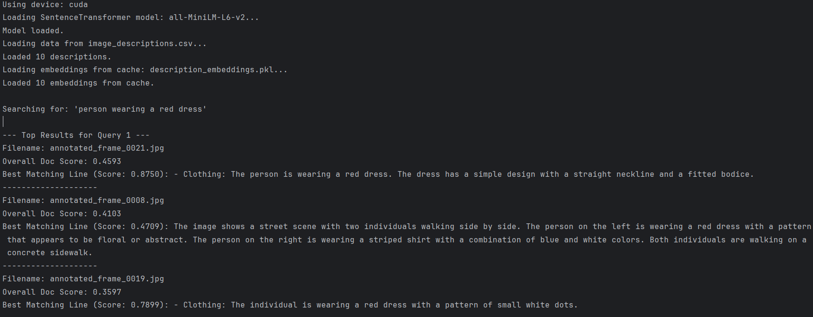

# PersonDetection-system

A Python-based system for detecting persons in images and videos using YOLO (You Only Look Once) object detection. This repository is structured to handle video inputs, process frames, and output detection results.

## Features

- **Person Detection:** Utilizes YOLO weights for accurate and real-time person detection.
- **Video Handling:** Processes video streams and outputs detection results.
- **Modular Structure:** Organized into components for easy maintenance and extension.

## Repository Structure

PersonDetection-system

├── Output-Result    
├── Search-System    
├── Video-Handle      
├── yolo-weights       
└── README.md         

## 🚀 Getting Started

### Prerequisites

Ensure you have the following installed:

- Python 3.7+
- OpenCV
- NumPy
- PyTorch (if using YOLOv5 or similar)
- Other dependencies (see `requirements.txt` if available)

Install required Python packages:

    pip install -r requirements.txt

## YOLO Weights

Download YOLO weights (if not included) from the official source:

- [YOLOv8 weights](https://docs.ultralytics.com/models/yolov8/#key-features-of-yolov8)

Place the weights in the `yolo-weights/` directory.

---

## 🧠 How It Works

1. **Video Processing:**  
   The system loads and processes video files frame-by-frame.

2. **Detection:**  
   YOLO detects people in each frame.

3. **Tracking/Search:**  
   Optionally, the system supports tracking or searching for specific persons.

4. **Output:**  
   Annotated video and detection metadata are saved in `Output-Result/`.

---

## 📸 Example Output

---

## 🛠️ Future Improvements

- Person re-identification across multiple videos
- Improved UI for video selection and playback
- Integration with surveillance feeds

---

## 🤝 Contributing

Contributions are welcome! Please fork the repository and submit a pull request.

